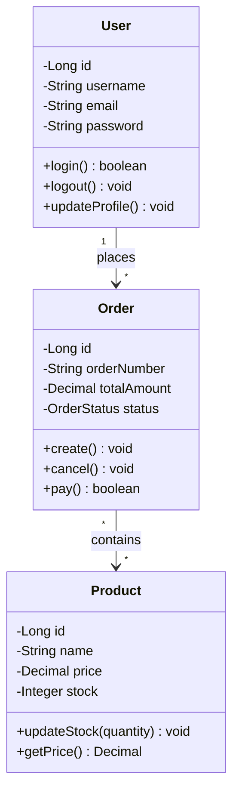
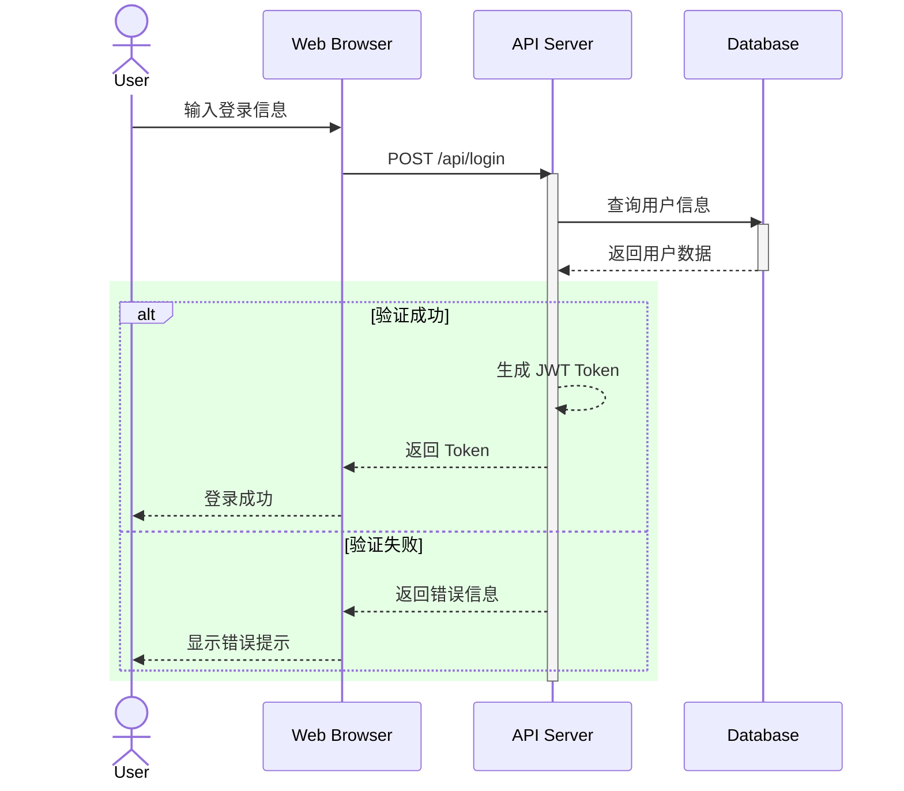
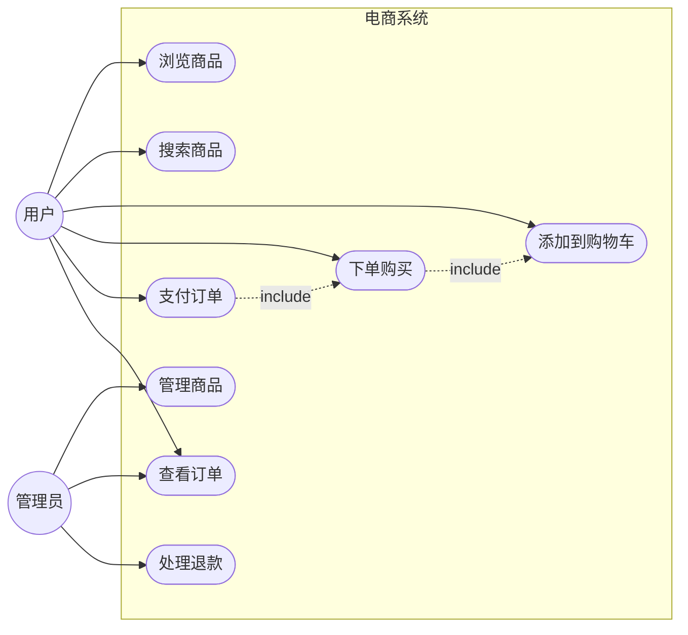
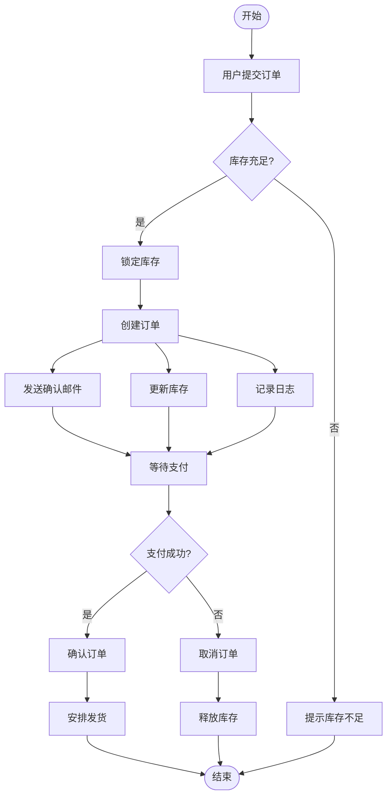
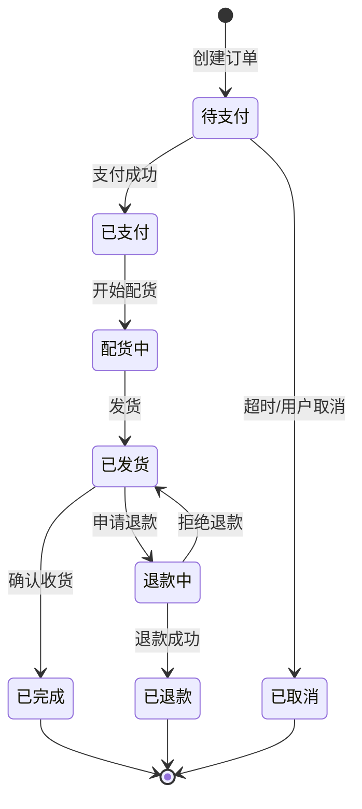
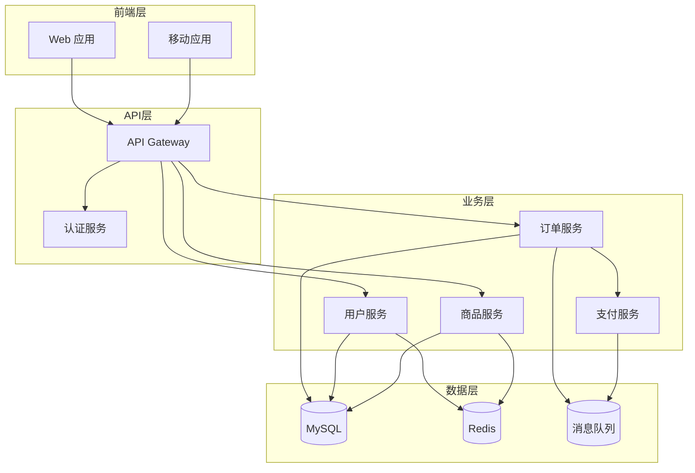
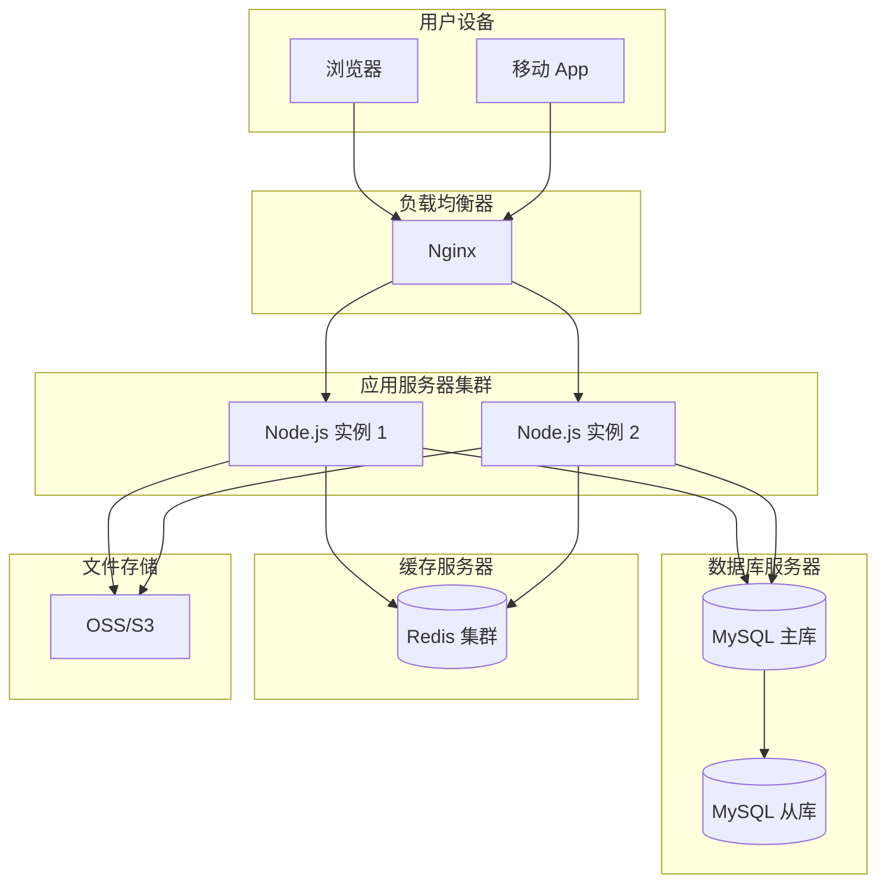

# UML 图表设计

## 功能说明
此技能专门用于 UML(统一建模语言)图表的设计和绘制,包括:
- 系统架构设计
- 类图和对象图
- 时序图和协作图
- 用例图和活动图
- 状态图和部署图
- 组件图和包图

## 使用场景
- "绘制用户登录的时序图"
- "创建系统架构图"
- "设计数据库 ER 图"
- "绘制业务流程图"
- "创建用例图展示系统功能"

## 工作流程
1. 理解需求：分析用户想要的图表类型和内容
2. 生成mermaid：根据需求生成对应的 mermaid 代码
3. 返回给用户对应的 mermaid 代码

## UML 图表类型

### 1. 类图(Class Diagram)
用于展示系统中的类、属性、方法及其关系。

**关系类型**:
- **关联(Association)**:实线,表示类之间的关系
- **聚合(Aggregation)**:空心菱形,表示整体-部分关系
- **组合(Composition)**:实心菱形,表示强整体-部分关系
- **继承(Inheritance)**:空心三角箭头,表示is-a关系
- **实现(Realization)**:虚线空心三角箭头,表示接口实现
- **依赖(Dependency)**:虚线箭头,表示使用关系

### 2. 时序图(Sequence Diagram)
展示对象之间的交互顺序和消息传递。

**元素说明**:
- **Actor**:参与者(用户或外部系统)
- **Participant**:对象或组件
- **Message**:消息传递(同步/异步)
- **Activation/deactivate**:对象激活期间
- **Alt/Opt/Loop**:条件、可选、循环（使用不同rgba背景色区分alt/opt/loop块)

### 3. 用例图(Use Case Diagram)
展示系统功能和参与者之间的关系。

**关系类型**:
- **关联**:参与者与用例之间的关系
- **包含(include)**:必须执行的用例
- **扩展(extend)**:可选执行的用例
- **泛化**:用例之间的继承关系

### 4. 活动图(Activity Diagram)
展示业务流程或算法的执行流程。

### 5. 状态图(State Diagram)

### 6. 组件图(Component Diagram)

### 7. 部署图(Deployment Diagram)

## 注意事项
- 选择合适的图表类型
- 保持图表简洁清晰
- 使用一致的命名规范
- 及时更新文档
- 考虑图表的可读性
- 避免过度设计
- 使用版本控制管理图表文件
- 与团队保持沟通